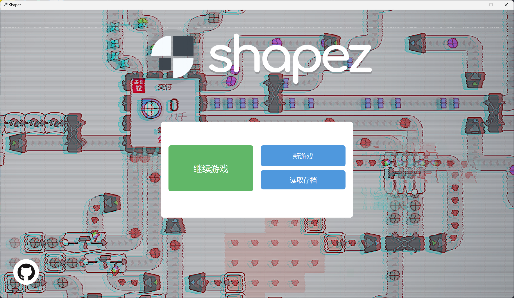
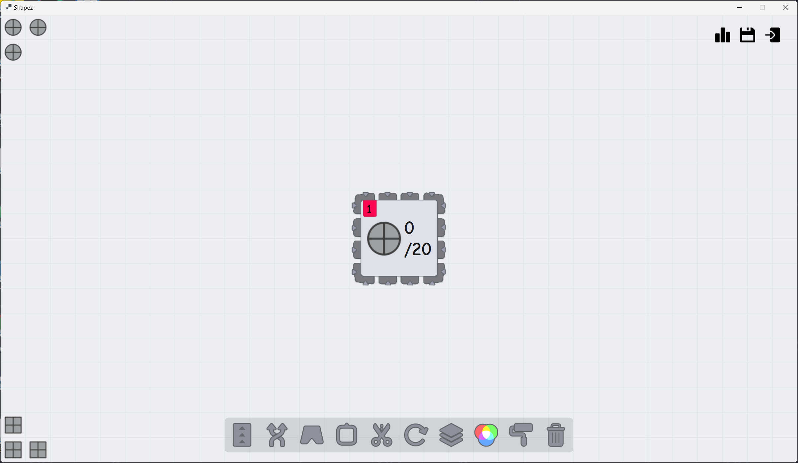
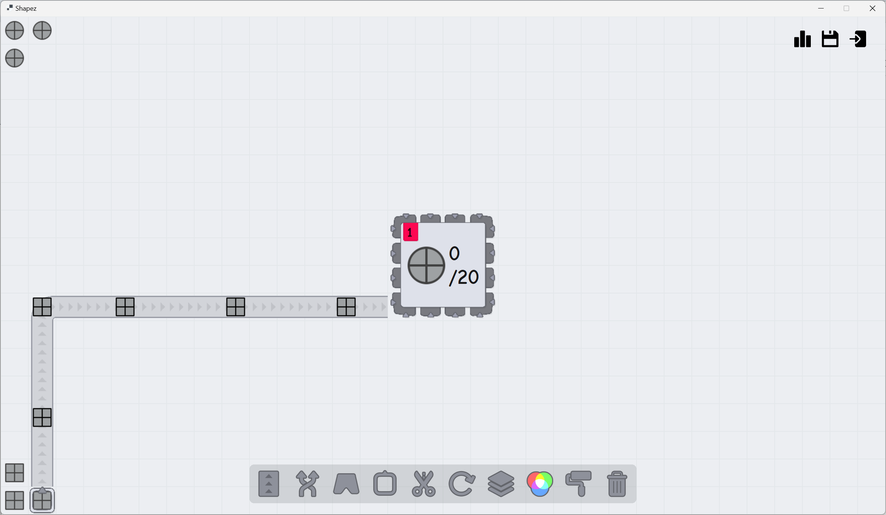

# **异形工厂（shapez）**

### **简介**
高级程序设计（c++）项目，使用QT简单实现异形工厂（shapez）。

### **说明**
素材来源即部分实现参考[shapez]([text](https://github.com/tobspr-games/shapez.io)), 仅作为学习使用。由于时间和能力原因，仅完成传送带，开采器，切割机和垃圾桶等部件。

### **操作介绍**
大多数操作可以使用鼠标完成。
R键旋转，T键转换传送带样式。

### **图片展示**
启动界面

游戏界面

